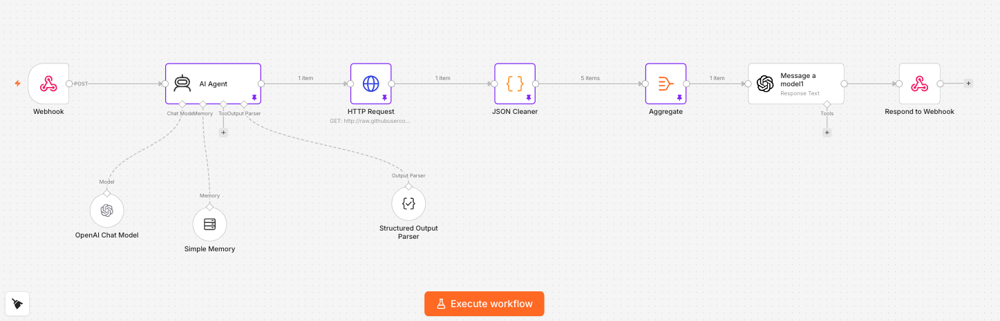

# MedMatch — Conversational AI Healthcare Navigation Agent

MedMatch is a conversational AI agent that helps people find the right doctor without wading through the complexity of healthcare search. A user describes what they need in plain language ("I need a primary care doctor near 10016 who takes Cigna"), and the agent interprets the request, retrieves matching providers, and returns a clear, ranked shortlist — while staying inside firm safety guardrails.

Built as a graduate product project (NYU Stern MBA, *Foundations of AI Agents*). **My role:** I owned the evaluation strategy, created the initial n8n agent flow, and contributed across the build.

---

## The problem

Finding a doctor is a high-friction, high-stakes task: people don't know which specialty they need, whether a provider takes their insurance, or who's actually available soon. Existing search tools push all of that work onto the user. MedMatch turns a messy, natural-language request into an actionable shortlist — and knows when *not* to help (e.g., emergencies).

## What it does

- **Interprets intent** — maps symptoms or plain-language requests to the right medical specialty (defaults to Primary Care for general/annual visits).
- **Extracts structured criteria** — specialty, location (accepts ZIP → maps to city/state), insurance, urgency, and preferences, emitted as validated JSON.
- **Asks only when necessary** — requests the minimum clarifying info to proceed; never re-asks for details already given.
- **Retrieves and ranks providers** — filters to providers accepting new patients and ranks them deterministically by soonest availability → rating → proximity, returning a top-5 shortlist with address, next availability, and phone.
- **Remembers the conversation** — session-keyed memory so follow-ups stay in context.

## Safety guardrails (the part that matters most in healthcare)

- **Emergency detection** — if the request suggests an emergency, the agent stops the normal flow and directs the user to call 911.
- **No medical advice** — the agent will not provide diagnosis, treatment, or clinical recommendations, even when pressed; it redirects to finding a qualified provider instead.
- **No silent actions** — it never books or takes action without explicit user confirmation.

## Architecture

Built in **n8n** as a two-stage agentic pipeline:

```
User message ──> Webhook
                   │
                   ▼
          AI Agent (GPT-5-mini, LangChain)  ◄── Session memory
          • symptom → specialty
          • extract criteria → structured JSON   ◄── Structured Output Parser
          • emergency / no-diagnosis guardrails
                   │
                   ▼
          Retrieve providers (HTTP) ──> Clean JSON ──> Aggregate
                   │
                   ▼
          Ranking + response LLM (GPT-5-mini)
          • filter: accepting new patients
          • rank: availability → rating → distance
          • format friendly top-5  + re-check emergency
                   │
                   ▼
              Respond to user
```

**Stack:** n8n · LangChain agent node · OpenAI GPT-5-mini · structured output parser · session buffer memory · webhook I/O.



The workflow export is in [`workflow/medmatch-flow.json`](workflow/medmatch-flow.json).

## Scope & limitations

- **Provider data is a sample dataset**: this is not not a live integration. The prototype reads a fixed set of mock providers; a production version would connect a live provider source (e.g., a Zocdoc/Apify feed) behind the same interface.
- **Prototype, not a shipped product**: this is built to validate the agent design, the discovery flow, and the safety behavior. It is not inteded for clinical use.
- **Not a medical device and gives no medical advice** — see guardrails above.

## Evaluation

The agent was evaluated with a structured **human + LLM-as-judge** process across 13 test queries, scored 0–3 on Behavior Appropriateness, Constraint Handling, and Tone & Style. The eval surfaced real safety/reliability gaps (no urgency triage, proceeding without clarification, assumption-filling) and produced concrete recommendations — an urgency-check layer and a clarification gate — which map to the emergency-escalation and clarification behaviors in the agent.

Full methodology, rubric, findings, and scored dataset: **[`evals/`](evals/)**.

## What I'd build next

- Swap the sample provider feed for a live source and handle real-world data gaps (missing availability, stale insurance lists).
- Expand the eval set and automate it as a regression suite run on every prompt change.
- Instrument drop-off and clarifying-question rate to reduce friction in the intake conversation.
